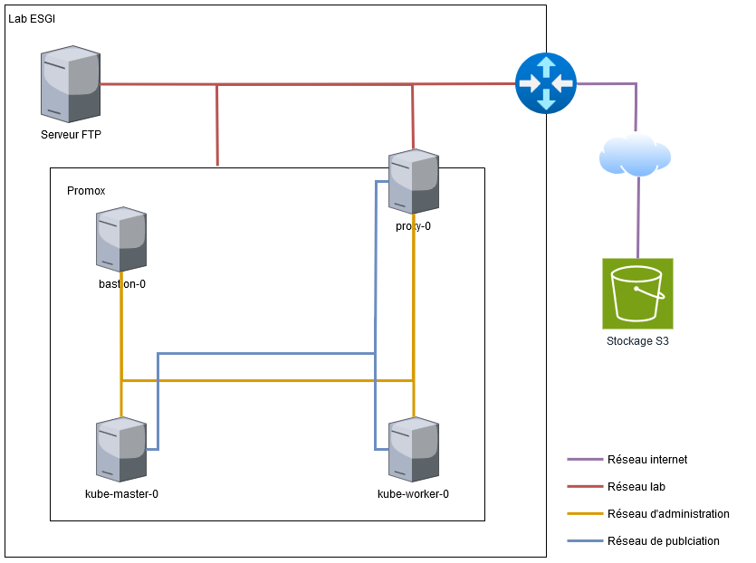

# 🚀 Projet équipe ESGI 🚀 
## Parce que pourquoi faire simple quand on peut faire compliqué ?

---
## Objectif : Déployer une infrastructure... overkill
### Le besoin 
- 3 vms : un proxy, un site web une db
- de la sauvegarde avec la  règle du 3:2:1
- Du monitoring
- un hyperviseur Promox

### La stack
Ici, on ne fait pas les choses à moitié. On a pris ce besoin simple et on a décidé d’y répondre avec 

- 🥷 **__Orchestration :__** Kubernetes, évidemment. Pour déployer un simple site web, un cluster complet s’imposait.
- 🦾 **__Reverse Proxy :__** HAProxy + Ingress NGINX. Parce qu’un proxy simple, c’est trop facile.
- 👀 **__Monitoring :__** Prometheus + Grafana avec kube prometheus stack. On voulait tout voir. *(Et en plus on a les alertes qui remontent sur discord)*
- 🛡 **__Sécurité :__**
    1. CrowdSec pour botter les fesses des attaquants.
    2. Wazuh pour un SIEM et XDR parce que **"on sait jamais"**. *(Si tu te trompe de MDP ou d'user tu es ban pendant 2 mins)*
    3. Certificats SSL pour tout chiffrer, même les logs d'erreur *(c'est  pas vrai)*.  
- 💾 **__Sauvegarde :__** Restic. Parce que perdre des données, c’est pour les faibles.
- 🤖 **__Déploiement Automatique :__** Ansible + GitHub Actions. Une ligne de commande et BAM 💥, tout est en place, *ou presque*.  De toute façon setup les machines à la main une par une ça ne se fait plus.

### Pourquoi ?
- Parce que c'est **fun**. 
- Parce qu'on aime **ansible** et qu'on veut le **montrer**.
- Parce que "overengineering" est notre deuxième prénom.
- Parce que **kube n'est jamais surdimensionné**.

## 📐 Architecture

- Un hyperviseur Proxmox parce qu’on avait pas le choix maison.
- Des VMs en veux-tu en voilà, bien optimisées… enfin, presque.
- Un réseau privé et un réseau public pour faire genre on est des pros.
- Un bastion SSH, parce que la sécurité avant tout.
- Un stockage local SFTP pour les sauvegardes, parce que c’est bien de sauvegarder, mais c’est mieux de sauvegarder les sauvegardes donc il y a une bucket S3 externe.



### 📌 Ressources allouées aux VMs

| VM	            | CPU	 | RAM (Go) | Disque 1 (Go	 | Disque 2 (Go) |
|----------------|------|----------|---------------|---------------|
| Bastion-0	     | 1	   | 1	       | 10	           | N/A           |
| Kube-master-0	 | 2	   | 3	       | 10	           | N/A           |
| Kube-worker-0	 | 2	   | 8	       | 10	           | 100           |
| Kube-proxy-0	  | 1	   | 2	       | 10	           | N/A           |

💡 Total utilisé :

    CPU : 6/4 cœurs (un peu serré mais on aime le challenge 💀)
    RAM : 14/14 Go (optimisation maximale 📈)
    Stockage : 140/200 Go

### 🌐 Réseaux et Bind des Interfaces
| VM	            | Eth0 (admin)	 | eth1(publication) | eth3 (campus) |
|----------------|---------------|-------------------|---------------|
| Bastion-0	     | 10.100.0.1    | NC	               | NC            |
| Kube-proxy-0	  | 10.100.0.10   | 10.0.0.10         | 10.255.0.112  |
| Kube-master-0	 | 10.100.0.20   | 10.0.0.20         | NC            |
| Kube-worker-0	 | 10.100.0.30   | 10.0.0.30         | NC            |
| Proxmox	       | NC	           | NC	               | 10.255.0.102  |

📌 Explications :
- Réseau d’administration (10.100.0.0/24) → Pour la gestion interne.
- Réseau de publication (10.0.0.0/24) → Pour exposer les services web. 
- Réseau campus (10.255.0.0/24) → Accès externe via IP publique.
- kube-proxy-0 agit comme passerelle NAT pour donner un accès Internet aux VMs.

---
## 🚀 Installation et déploiement
1️⃣ Prépare l’infra
Setup un proxmox avec du cloud init (on va quand même pas se taper le setup de la VM à la main). Et pop 3 VMs avec les ressources et les réseaux indiqués plus haut.

2️⃣ Clone le repo
Clone ce repo et prépare-toi mentalement. Tu vas devoir rentrer des commandes dans un terminal.
```shell
git clone https://github.com/tonrepo.git
cd tonrepo
```
3️⃣ Déploie avec Ansible
```shell
ansible-playbook -i inventories-proxy.yaml --ask-vault-pass playbook-firstInstall.yml
ansible-playbook -i inventories-proxybastion.yaml --ask-vault-pass playbook.yml
```
4️⃣ Déploie le site web
```shell
kubectl apply -f ./web.yaml
```
---
## 🎯 Pourquoi ce projet est incroyable ?

- ✅ Overkill – On a mis la NASA dans un petit projet pour l'école.
- ✅ Automatisé – Une seule commande et tout roule (presque).
- ✅ Sécurisé – Parce qu’on ne rigole pas avec la cybersécurité.
- ✅ Montrable sur LinkedIn – Le genre de projet qui en impose.
- ✅ Fun – Parce qu’on aime ça.

---
## Membres de l'équipe
- SRC *(OMG il construit des infra)* : [**@simonlou**](https://github.com/SimonLou-Dev)
- SI *(La sécurité c'est important)* : [**@CORT1N**](https://github.com/CORT1N) [**TKaY**](https://github.com/gruv0o)
- DEVs *(Il nous faut un site quand même)* : [**@P0CEE**](https://github.com/P0CEE), [**@Matheo**](https://github.com/MatheoWintrebert), [**@darkgug**](https://github.com/darkgugu)